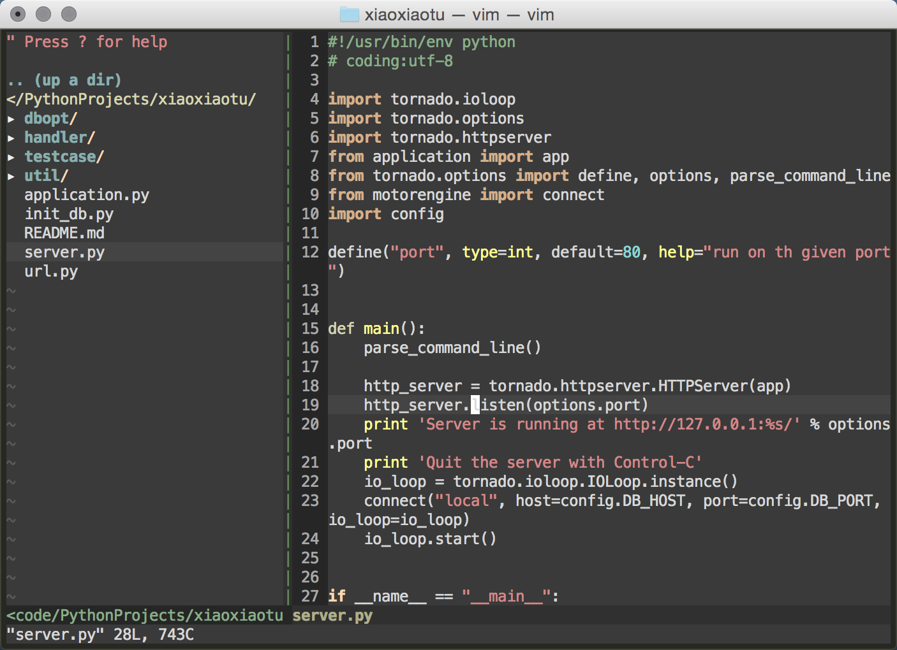

# README
`.vimrc` for python dev.

### Screenshot

### Feature
- 使用 [Vundle](https://github.com/VundleVim/Vundle.vim) 进行插件管理
- 使用 Zenburn 主题色
- 使用 [NerdTree](https://github.com/scrooloose/nerdtree) 目录树插件
- 使用 [YouCompleteMe](https://github.com/Valloric/YouCompleteMe) 进行语法提示
- 语法检查以及语法着色
- 新建 `py` 文件时自动插入文件头

### 映射键位
| Hotkey | Action |
| ------ | -------|
**F6** | **保存并使用 Python3 运行当前脚本**
**F10** | **开关目录树**
**\rt** | **替换所有 Tab 符为空格符**
**\<数字键>** | **切换到相应的选项卡**
**Ctrl + t** | **新建选项卡**
**;** | **进入命令模式（相当于 `:` 键）**
**\/** | **去掉所有（搜索）高亮词**
**U** | **重做上一个撤销的操作**
**Ctrl + c** | **注释或则反注释该行**

